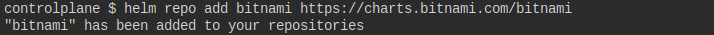
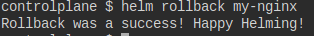

1- Add bitnami helm chart repository in the controlplane node.

```helm repo add bitnami https://charts.bitnami.com/bitnami```



2- Deploy the Apache application on the cluster using the apache from the bitnami repository. Set the release Name to: amaze-surf

``` helm install amaze-surf bitnami/apache ```


3- Uninstall the apache chart release  from the cluster

``` helm uninstall amaze-surf ```


4- install specfic version of nginx 1.22.0, then update it to specfic 1.23.1, then rollback

```bash
helm search repo nginx --versions
helm install my-nginx bitnami/nginx --version 12.0.6
helm upgrade my-nginx bitnami/nginx --version 13.2.10
helm rollback my-nginx
```



